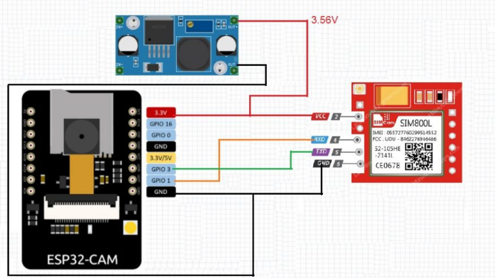

[comment]: # "This is the standard layout for the project, but you can clean this and use your own template"

# Development of an Image Capturing Unit for Remote Monitoring

---

[comment]: # "This is a sample image, to show how to add images to your page. To learn more options, please refer [this](https://projects.ce.pdn.ac.lk/docs/faq/how-to-add-an-image/)"

## The basic design of the project

## The Solution Infrastructure

## Project Timeline

## Team
-  E/18/245, Nishani K, [email](mailto:e18245@eng.pdn.ac.lk)
-  E/18/340, Subramanieam V, [email](mailto:e18340@eng.pdn.ac.lk)
-  E/18/373, Vilakshan V, [email](mailto:e18373@eng.pdn.ac.lk)

## Table of Contents
1. [Introduction](#introduction)
2. [Other Sub Topics](#other-sub-topics)
3. [Links](#links)

---

## Introduction

To monitor the process of a controlled systems it is required to view the operation in real time. For this we create software that will capture and transfer images to a remote location so that the operation of the controlled system can be monitored.

## Other Sub Topics

.....

## Links

- [Project Repository](https://github.com/cepdnaclk/{{ page.repository-name }}){:target="_blank"}
- [Project Page](https://cepdnaclk.github.io/{{ page.repository-name}}){:target="_blank"}
- [Department of Computer Engineering](http://www.ce.pdn.ac.lk/)
- [University of Peradeniya](https://eng.pdn.ac.lk/)

[//]: # (Please refer this to learn more about Markdown syntax)
[//]: # (https://github.com/adam-p/markdown-here/wiki/Markdown-Cheatsheet)
